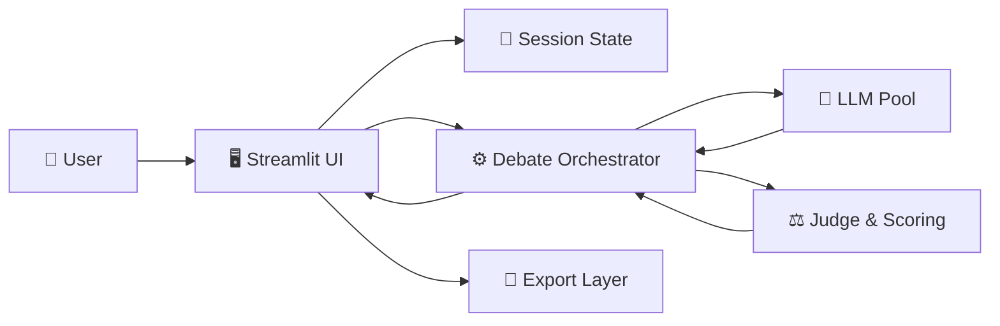
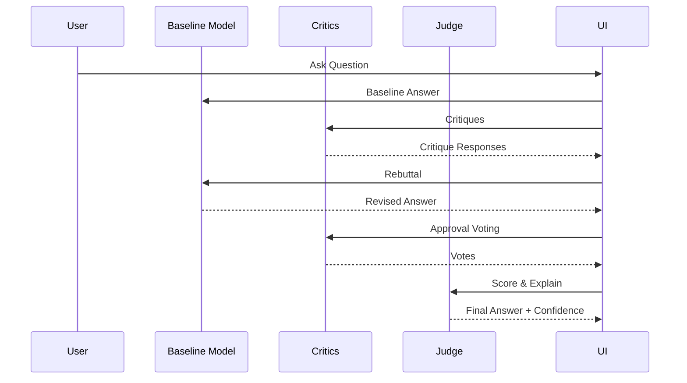
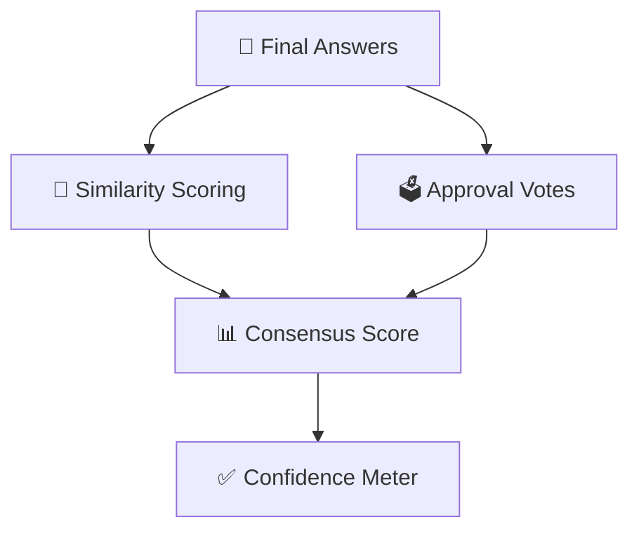

# 🤖 djGPT — Multi-Model Debate Engine for Reliable AI Answers

djGPT is an experimental **multi-LLM debate and consensus system** that forces AI models to **disagree, critique, rebut, and vote** before producing a final answer.

Instead of trusting a single model response, djGPT orchestrates **structured AI debates**, computes **confidence scores**, and explains **why a particular answer won**.

> Think of it as *peer review for AI responses*.

---

## ✨ Why djGPT Exists

Most AI chat systems:

* Show **one answer**
* Hide internal reasoning
* Provide **no confidence or disagreement signal**

djGPT does the opposite:

* Surfaces **model disagreements**
* Forces **rebuttals**
* Produces a **confidence-scored consensus**
* Explains **why the final answer was chosen**

This makes it ideal for:

* Research
* Architecture decisions
* Learning & comparison
* High-stakes reasoning tasks

---

## 🧠 Core Features

### 🔁 Multi-Model Debate Engine

* One **baseline model** answers first
* Other models act as **critics**
* Baseline performs **iterative rebuttals**
* Debate continues until approval threshold is met

### 🧾 Transparent Debate Visualization

* Live streaming of:

  * Baseline answer
  * Critiques
  * Rebuttals
* Final result collapses into a **clean consensus card**
* Full debate remains accessible in a dropdown

### 🏆 Automatic Winner Selection

* Uses **inter-model similarity scoring**
* Approval voting by critics
* Produces a **quantified consensus score**

### 📊 Confidence Meter

* Confidence derived from:

  * Agreement ratio
  * Similarity between final answers
* Displayed as a percentage with explanation

### 🧠 “Why This Answer Won”

* LLM-generated judge analysis explaining:

  * Key differences
  * Contradictions
  * Why the winning answer is stronger

### 🕰️ Debate Timeline

* Clear phase separation:

  * Baseline
  * Critique rounds
  * Rebuttals
  * Voting
* Makes reasoning progression visible

### 🔍 Diff Highlighting

* Differences vs baseline are highlighted
* Helps quickly see **what changed and why**

### 🖼️ Vision Model Support

* Automatically filters models when an image is uploaded
* Supports multimodal prompts

### 📄 Export

* Markdown report export
* PDF export (optional)

---

## 🧩 Supported Models

* `gpt-oss:120b-cloud`
* `deepseek-v3.1:671b-cloud`
* `gemma3:27b-cloud`
* `ministral-3:14b-cloud`
* `qwen3-vl:235b-cloud` (vision)
* `qwen3-coder:480b-cloud` (code)

Supports:

* **Cloud**
* **Local**

---

## 🏗️ System Architecture

### High-Level Architecture



---

### Debate Engine Flow



---

## 🧠 Confidence & Scoring Logic



---

## 🛠️ Tech Stack

* **Frontend**: Streamlit
* **Backend**: Python
* **LLM Orchestration**
* **State Management**: Streamlit Session State
* **Export**: Markdown, PDF (FPDF)
* **Styling**: Custom CSS (dark, compact, table-safe)

---

## 🚀 Running Locally

### 1️⃣ Install Dependencies

```bash
pip install -r requirements.txt
```

### 3️⃣ Start the App

```bash
streamlit run app.py
```

---

## 📁 Project Structure

```
ChatBotMaster/
├── app.py          # Full UI + logic (single-file design)
├── requirements.txt
├── README.md
├── .env            # Local only (gitignored)
└── .streamlit/
    └── secrets.toml
```

---

## 🎯 What Makes djGPT Different

| Feature               | djGPT | Typical Chatbots |
| --------------------- | ----- | ---------------- |
| Multi-model debate    | ✅     | ❌                |
| Visible disagreement  | ✅     | ❌                |
| Confidence scoring    | ✅     | ❌                |
| Rebuttal rounds       | ✅     | ❌                |
| Explanation of winner | ✅     | ❌                |
| Exportable reasoning  | ✅     | ❌                |

---

## 📌 Use Cases

* Comparing LLMs
* Learning by disagreement
* Research validation
* Architecture decisions
* AI transparency experiments
* Portfolio / resume showcase

---

## 🔮 Future Ideas

* Model credibility tracking
* Per-topic confidence history
* Public debate sharing links
* Human-in-the-loop voting
* Multi-turn debate memory

---

## 🧠 Author Notes

djGPT was built as an **exploration into AI reliability, transparency, and disagreement**.

The goal is not just better answers —
but **answers you can trust**.

---

## 📜 License

MIT License

---
